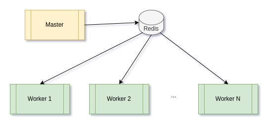
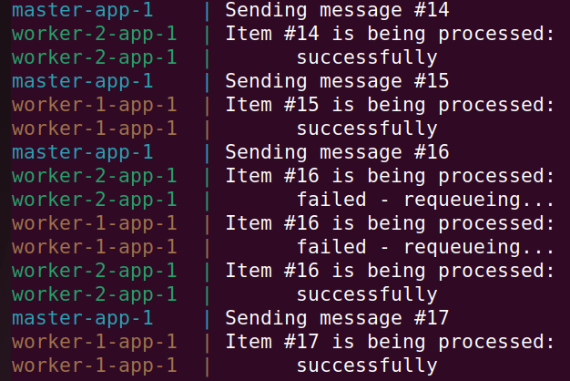
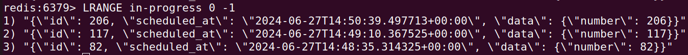

## Straightforward scalability of distributed computing.

A common practice for speeding up CPU-bound operations is to distribute the computation.
One method to achieve this is by using multiprocessing,
but this approach is limited by the number of cores available on the host machine.
Implementing a simple 'Master-Worker' pattern can enable near-unlimited scalability
<br/>

In this example, **Master** sends data to **Workers** for processing via a Redis **Queue**. 



With this approach, you can start with a single computer and easily scale up
by using multiple nodes if more cores are needed. The services are containerized,
which makes it easier to use Kubernetes or other orchestration engines.

### Running the example using Docker
to start execution
```shell
docker compose up
```
to stop execution
```shell
docker compose down -v
```

### Description
**Master** pushes messages into a Redis **Queue**.
**Workers** retrieve messages from the **Queue** to process them. 
If message processing fails, the message is requeued.
<br/>



A 'reliable queue' pattern is implemented to ensure the safety of messages if a worker crashes: 
while processing, a message is stored in a temporary queue and is only removed after the processing is finished.
<br/>




