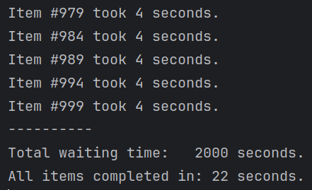

## _Producer - Consumer_ pattern using AsyncIO

> For **I/O-bound** operations asyncio gives a significant performance improvement when running **multiple tasks concurrently**.

In this example, a **Producer** provides data for a **Consumer** to process through a **Queue**.
The Queue has a limited size. When it is full and can no longer accept any data, the Producer waits until it has free space. 

Processing performed by the **Consumer** also includes a delay when the system is idle and just waiting for a response from an external resource.
Using asynchronous tasks in this case allows to reduce the processing time by performing the other work during the delay.

<br/>

> 
> 
> In this example, what would have taken 2000 seconds in a sequential mode took 22 seconds when implemented concurrently.

<br/>

### Installation
to create a virtual environment with 'dev' dependencies run
```shell
pipenv install --dev
```
to activate the virtual environment run
```shell
pipenv shell
```
to format the code base run
```shell
make format
```
(Amend _pyproject.toml_ for _black_ and _isort_ configuration if needed)


<br/>

### Running the example
to run the example
```shell
python main.py
```

<br/>

### Quit
to deactivate the virtual environment exit the shell session
```shell
exit
```


